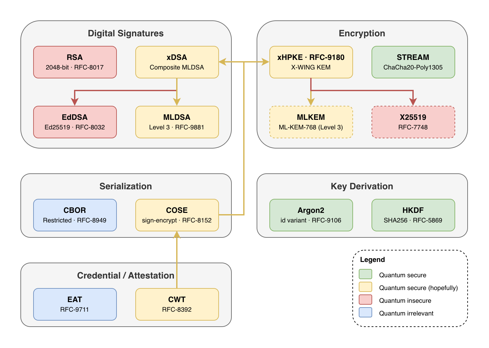

# Post-Quantum Cryptography in Flutter

This repository is parameter selection and lightweight wrapper around a number of (FFI wrapped) Rust cryptographic libraries. Its purpose isn't to implement primitives, rather to unify the API surface of existing libraries; limited to the tiny subset needed by the Dark Bio project.

The library is opinionated. Parameters and primitives were selected to provide matching levels of security in a post-quantum world. APIs were designed to make the library easy to use and hard to misuse. Flexibility will always be rejected in favor of safety.

- Digital signatures
  - **xDSA ([RFC-DRAFT](https://datatracker.ietf.org/doc/html/draft-ietf-lamps-pq-composite-sigs))**: `MLDSA`, `EdDSA`, `SHA512`
    - **EdDSA ([RFC-8032](https://datatracker.ietf.org/doc/html/rfc8032))**: `Ed25519`
    - **MLDSA ([RFC-9881](https://datatracker.ietf.org/doc/html/rfc9881))**: Security level 3 (`ML-DSA-65`)
  - **RSA ([RFC-8017](https://datatracker.ietf.org/doc/html/rfc8017))**: 2048-bit, `SHA256`
- Encryption
  - **xHPKE ([RFC-9180](https://datatracker.ietf.org/doc/html/rfc9180))**: `X-WING`, `HKDF`, `SHA256`, `ChaCha20`, `Poly1305`, `dark-bio-v1:` domain prefix
    - **X-WING ([RFC-DRAFT](https://datatracker.ietf.org/doc/html/draft-connolly-cfrg-xwing-kem))**: `MLKEM`, `ECC`
      - **ECC ([RFC-7748](https://datatracker.ietf.org/doc/html/rfc7748))**: `X25519`
      - **MLKEM([RFC-DRAFT](https://datatracker.ietf.org/doc/html/draft-ietf-ipsecme-ikev2-mlkem))**: Security level 3 (`ML-KEM-768`)
  - **STREAM (*RFC N/A*, [Rage](https://github.com/str4d/rage))**: `ChaCha20`, `Poly1305`, `16B` tag, `64KB` chunk
- Key derivation
  - **Argon2 ([RFC-9106](https://datatracker.ietf.org/doc/html/rfc9106))**: `id` variant
  - **HKDF ([RFC-5869](https://datatracker.ietf.org/doc/html/rfc5869))**: `SHA256`
- Serialization
  - **CBOR¹ ([RFC-8949](https://datatracker.ietf.org/doc/html/rfc8949))**: restricted to `bool`,`null`, `integer`, `text`, `bytes`, `array`, `map[int]`, `option`
  - **COSE ([RFC-8152](https://datatracker.ietf.org/doc/html/rfc8152))**: `COSE_Sign1`, `COSE_Encrypt0`, `dark-bio-v1:` domain prefix
- Credential / Attestation
  - **CWT ([RFC-8392](https://datatracker.ietf.org/doc/html/rfc8392))**: `xDSA`, `xHPKE`
    - **EAT ([RFC-9711](https://datatracker.ietf.org/doc/html/rfc9711))**

*¹ As CBOR encoding/decoding would require a full reimplementation in Dart, that is delegated to any preferred 3rd party library. To ensure correctness, this package provides a `cbor.verify`, which it also implicitly enforces when crossing through `cose` and `cwt`.*

## Native packages

The underlying implementation exists in two sibling repos, which track the same feature set and API surfaces, released at corresponding version points.

- Rust [`github.com/dark-bio/crypto-rs`](https://github.com/dark-bio/crypto-rs)
- Go [`github.com/dark-bio/crypto-go`](https://github.com/dark-bio/crypto-go)

Sibling wrapper exists in one other repo:

- TypeScript [`github.com/dark-bio/crypto-ts`](https://github.com/dark-bio/crypto-ts)

## Acknowledgements

Shoutout to Filippo Valsorda ([@filosottile](https://github.com/filosottile)) for lots of tips and nudges on what kind of cryptographic primitives to use and how to combine them properly; and also for his work in general on cryptography standards.

Naturally, many thanks to the authors of all the libraries this project depends on.
