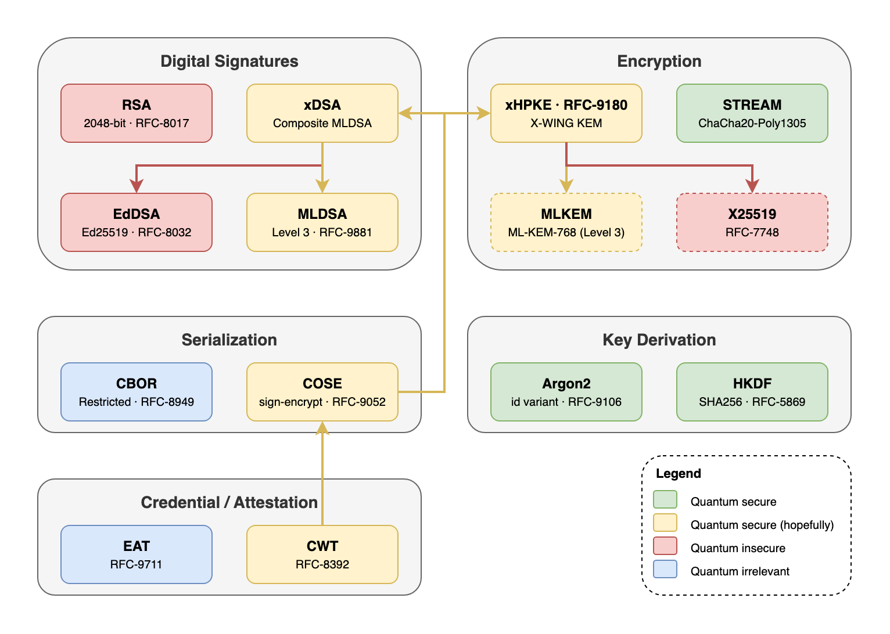

# Post-Quantum Cryptography in Flutter

[](https://pub.dev/packages/darkbio_crypto)
[](https://github.com/dark-bio/crypto-fl/actions/workflows/ci.yml)
[](https://github.com/dark-bio/crypto-fl/blob/main/LICENSE)

This repository is parameter selection and lightweight wrapper around a number of (FFI wrapped) Rust cryptographic libraries. Its purpose isn't to implement primitives, rather to unify the API surface of existing libraries; limited to the tiny subset needed by the Dark Bio project.

The library is opinionated. Parameters and primitives were selected to provide matching levels of security in a post-quantum world. APIs were designed to make the library easy to use and hard to misuse. Flexibility will always be rejected in favor of safety.



- Digital signatures
  - **xDSA ([RFC-DRAFT](https://datatracker.ietf.org/doc/html/draft-ietf-lamps-pq-composite-sigs))**: `MLDSA`, `EdDSA`, `SHA512`
    - **EdDSA ([RFC-8032](https://datatracker.ietf.org/doc/html/rfc8032))**: `Ed25519`
    - **MLDSA ([RFC-9881](https://datatracker.ietf.org/doc/html/rfc9881))**: Security level 3 (`ML-DSA-65`)
  - **RSA ([RFC-8017](https://datatracker.ietf.org/doc/html/rfc8017))**: 2048-bit, `SHA256`
- Encryption
  - **xHPKE ([RFC-9180](https://datatracker.ietf.org/doc/html/rfc9180))**: `X-WING`, `HKDF`, `SHA256`, `ChaCha20`, `Poly1305`, `dark-bio-v1:` domain prefix
    - **X-WING ([RFC-DRAFT](https://datatracker.ietf.org/doc/html/draft-connolly-cfrg-xwing-kem))**: `MLKEM`, `ECC`
      - **ECC ([RFC-7748](https://datatracker.ietf.org/doc/html/rfc7748))**: `X25519`
      - **MLKEM ([FIPS-203](https://csrc.nist.gov/pubs/fips/203/final))**: Security level 3 (`ML-KEM-768`)
  - **STREAM (*RFC N/A*, [Rage](https://github.com/str4d/rage))**: `ChaCha20`, `Poly1305`, `16B` tag, `64KB` chunk
- Key derivation
  - **Argon2 ([RFC-9106](https://datatracker.ietf.org/doc/html/rfc9106))**: `id` variant
  - **HKDF ([RFC-5869](https://datatracker.ietf.org/doc/html/rfc5869))**: `SHA256`
- Serialization
  - **CBOR¹ ([RFC-8949](https://datatracker.ietf.org/doc/html/rfc8949))**: restricted to `bool`,`null`, `integer`, `text`, `bytes`, `array`, `map[int]`, `option`
  - **COSE ([RFC-9052](https://datatracker.ietf.org/doc/html/rfc9052))**: `COSE_Sign1`, `COSE_Encrypt0`, `dark-bio-v1:` domain prefix
- Credential / Attestation
  - **CWT ([RFC-8392](https://datatracker.ietf.org/doc/html/rfc8392))**: `xDSA`, `xHPKE`
    - **EAT ([RFC-9711](https://datatracker.ietf.org/doc/html/rfc9711))**

*¹ As CBOR encoding/decoding would require a full reimplementation in Dart, that is delegated to any preferred 3rd party library. To ensure correctness, this package provides a `cbor.verify`, which it also implicitly enforces when crossing through `cose` and `cwt`.*

## Quick start

Signatures come from `xdsa`, encryption from `xhpke`, and `cose` wraps both into COSE envelopes using the Dark Bio wire profile. Payloads and authenticated messages are plain Dart values within the CBOR subset above: `bool`, `null`, `int`, `String`, `Uint8List` for bytes, and lists and integer-keyed maps of those. The `cbor` library documents the details.

```sh
flutter pub add darkbio_crypto
```

COSE signing and verification and xHPKE encryption and decryption use an application domain that both sides must agree on. It is prefixed with `dark-bio-v1:` internally and binds the operation to one purpose. Choose distinct domains for distinct purposes. Raw `xdsa` signatures carry no such application domain, which is why the `cose` envelopes are the recommended entry point.

```dart
import 'dart:convert';

import 'package:darkbio_crypto/darkbio_crypto.dart' as darkbio;
import 'package:darkbio_crypto/cose.dart' as cose;
import 'package:darkbio_crypto/xdsa.dart' as xdsa;
import 'package:darkbio_crypto/xhpke.dart' as xhpke;

Future<String> example() async {
  // Load the native library once, before any other call
  await darkbio.init();

  // Long term identities, one for signing and one for receiving
  final signer = xdsa.SecretKey.generate();
  final recipient = xhpke.SecretKey.generate();
  final domain = utf8.encode('example');

  // A detached signature over a message that travels separately
  final signature = cose.signDetached(msgToAuth: 'payload', signer: signer, domain: domain);
  cose.verifyDetached(msgToCheck: signature, msgToAuth: 'payload', verifier: signer.publicKey(), domain: domain, maxDriftSecs: 60);

  // Sign and encrypt a payload to the recipient, then open and verify it back.
  // The second argument is authenticated but must be supplied separately.
  final sealed = cose.seal(msgToSeal: 'payload', msgToAuth: 'metadata', signer: signer, recipient: recipient.publicKey(), domain: domain);
  return cose.open<String>(msgToOpen: sealed, msgToAuth: 'metadata', recipient: recipient, sender: signer.publicKey(), domain: domain, maxDriftSecs: 60);
}
```

## Native packages

The underlying implementation exists in two sibling repos, which track the same feature set and API surfaces, released at corresponding version points.

- Rust [`github.com/dark-bio/crypto-rs`](https://github.com/dark-bio/crypto-rs)
- Go [`github.com/dark-bio/crypto-go`](https://github.com/dark-bio/crypto-go)

Sibling wrapper exists in one other repo:

- TypeScript [`github.com/dark-bio/crypto-ts`](https://github.com/dark-bio/crypto-ts)


## Acknowledgements

Shoutout to Filippo Valsorda ([@filosottile](https://github.com/filosottile)) for lots of tips and nudges on what kind of cryptographic primitives to use and how to combine them properly; and also for his work in general on cryptography standards.

Naturally, many thanks to the authors of all the libraries this project depends on.

## License

This library is licensed under the [BSD 3-Clause License](https://github.com/dark-bio/crypto-fl/blob/main/LICENSE).
